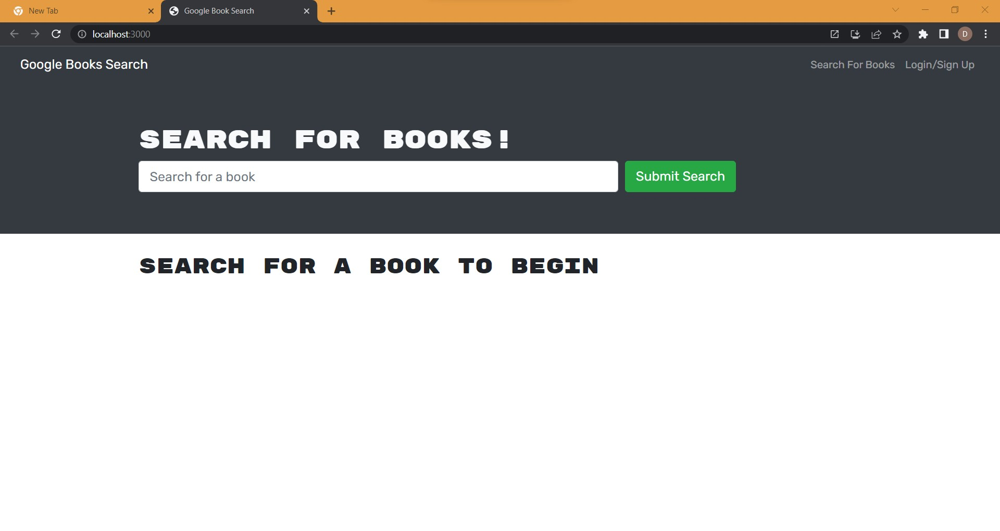

# Book-Search-Engine-David-Ryan
Bootcamp Homework 21.  Search engine for books using a google API.  Exemplifies a full stack MERN app using graphql, apollo server and jwt authentication.

## Table of Contents
* [Description](#general-description)
* [Deplyment](#deployment)
* [Screensot](#screenshot)
* [License](#license)
* [Contributing](#contributing)
* [Tests](#tests)
* [Questions](#questions)
    
    
## Description
This is a demonstration of a full stack MERN app that uses graphql and jwt authentication.  Also uses React.

UNFINISHED
"Your saved books" page still has an error that I don't have time to debug, focusing on Bootcamp Project 3.

## Deployment
Deployed using Heroku at https://book-search-engine-david-ryan.herokuapp.com/.

## Screenshot

## License
This repository is not licensed.

## Contributing
This is just a bootcamp assignment.  No contributions.

## Tests
No tests were created for this project.

## Questions
Any questions?  Contact me on GitHub @ https://github.com/Kadika38 or email dryan10101@gmail.com.